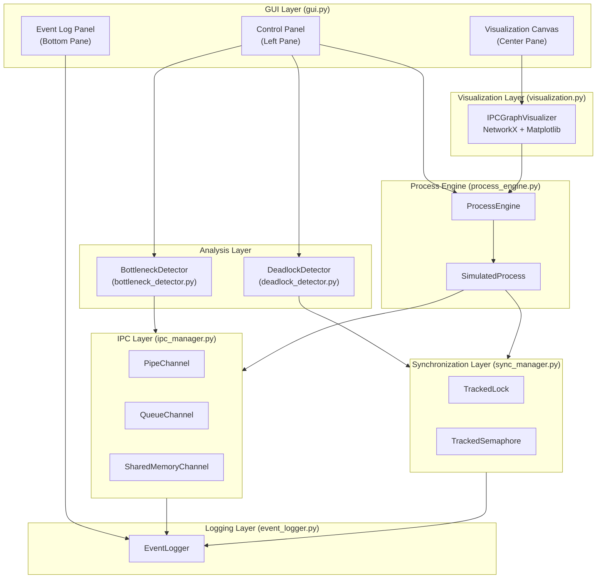
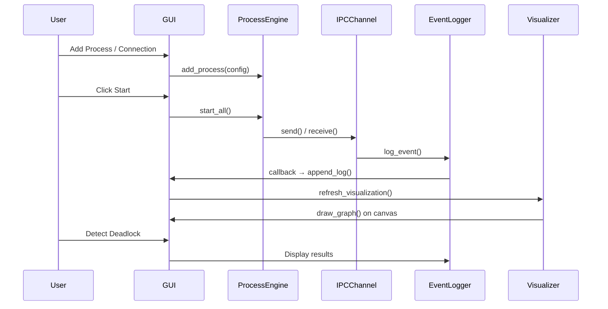

# 📋 IPC Debugger & Visualization Tool — Comprehensive Project Analysis Report

**Course:** CSE316 — Operating Systems  
**Project:** IPC Debugger & Visualization Tool (OS Project 2)  
**Date:** April 8, 2026  
**Author:** Auto-generated Analysis  

---

## Table of Contents

1. [Executive Summary](#1-executive-summary)
2. [Project Overview](#2-project-overview)
3. [Architecture Analysis](#3-architecture-analysis)
4. [Module-by-Module Deep Dive](#4-module-by-module-deep-dive)
5. [What Has Been Accomplished](#5-what-has-been-accomplished)
6. [What Is Currently Happening (Runtime Behavior)](#6-what-is-currently-happening)
7. [Code Quality Assessment](#7-code-quality-assessment)
8. [Identified Issues & Bugs](#8-identified-issues--bugs)
9. [Improvement Recommendations](#9-improvement-recommendations)
10. [Metrics & Statistics](#10-metrics--statistics)
11. [Conclusion](#11-conclusion)

---

## 1. Executive Summary

The **IPC Debugger & Visualization Tool** is a desktop application built in Python that simulates inter-process communication (IPC) scenarios, visualizes process topologies using NetworkX/Matplotlib graphs, and provides automated deadlock detection and bottleneck analysis — all within an interactive Tkinter GUI.

The project is **functionally complete** across all 8 modules (727+ lines of GUI code, 1,400+ lines of backend logic). It supports three IPC mechanisms (Pipe, Queue, Shared Memory), three preset scenarios (Normal IPC, Deadlock, Bottleneck), and a manual configuration mode. The codebase is well-structured, well-documented, and follows clean separation of concerns. However, there are several areas — from concurrency correctness to UX polish — that could be strengthened for production readiness.

---

## 2. Project Overview

### 2.1 Purpose
The tool serves as both a **debugging utility** and an **educational platform** for understanding:
- How processes communicate via pipes, queues, and shared memory
- How deadlocks form and are detected via Wait-For Graphs (WFG)
- How performance bottlenecks manifest in producer-consumer scenarios

### 2.2 Technology Stack

| Component | Technology | Purpose |
|-----------|-----------|---------|
| Language | Python 3.x | Core application logic |
| GUI Framework | Tkinter (+ ttk) | Desktop interface |
| Graph Library | NetworkX | Process topology & WFG modeling |
| Visualization | Matplotlib (TkAgg backend) | Graph & chart rendering |
| Concurrency | `threading` | Simulated process execution |
| IPC Primitives | `multiprocessing` (Pipe, Queue, Array) | Channel implementations |
| Data Structures | `collections.deque`, `dataclass` | Event logging |

### 2.3 Project File Structure

```
OS PROJECT 2/
├── main.py                          (49 lines,  1.1 KB)  — Entry point
├── event_logger.py                  (118 lines, 3.9 KB)  — Centralized event logging
├── ipc_manager.py                   (262 lines, 9.5 KB)  — IPC channel wrappers
├── sync_manager.py                  (191 lines, 6.5 KB)  — Lock/semaphore tracking
├── process_engine.py                (200 lines, 6.8 KB)  — Process simulation engine
├── deadlock_detector.py             (153 lines, 5.2 KB)  — WFG + DFS cycle detection
├── bottleneck_detector.py           (143 lines, 6.0 KB)  — Performance analysis
├── visualization.py                 (233 lines, 8.7 KB)  — Graph/chart rendering
├── gui.py                           (727 lines, 32.8 KB) — Tkinter GUI
├── IPC_Debugger_System_Design.md    (163 lines, 18.4 KB) — System design document
└── implementation_plan.md           (118 lines, 5.2 KB)  — Implementation plan
```

**Total Application Code:** ~2,076 lines of Python across 8 modules  
**Total Project Size:** ~98.8 KB  

---

## 3. Architecture Analysis

### 3.1 Layered Architecture Diagram



### 3.2 Data Flow



### 3.3 Architecture Assessment

| Aspect | Rating | Comments |
|--------|--------|----------|
| Separation of Concerns | ⭐⭐⭐⭐⭐ | Each module has a single, clear responsibility |
| Coupling | ⭐⭐⭐⭐ | Modules communicate through clean interfaces; EventLogger acts as a shared bus |
| Cohesion | ⭐⭐⭐⭐⭐ | High — each class is tightly focused |
| Extensibility | ⭐⭐⭐⭐ | Factory pattern for IPC channels; new types can be added easily |
| Testability | ⭐⭐⭐ | No test files exist; no dependency injection for mocking |

---

## 4. Module-by-Module Deep Dive

### 4.1 `main.py` — Entry Point (49 lines)

**What It Does:**
- Creates the root Tkinter window (1400×900, centered)
- Instantiates `IPCDebuggerGUI`
- Handles graceful shutdown via `WM_DELETE_WINDOW` protocol
- Calls `multiprocessing.freeze_support()` for Windows compatibility

**Assessment:** ✅ Clean and minimal. Properly handles window centering and shutdown.

---

### 4.2 `event_logger.py` — Centralized Logging (118 lines)

**What It Does:**
- `LogEvent` dataclass holds: timestamp, source/dest PIDs, action, data_size, details, channel info
- `EventLogger` provides thread-safe logging via `threading.Lock` and `deque(maxlen=10000)`
- Supports callback registration for real-time GUI updates
- Relative timestamps from simulation start

**Key Design Decisions:**
- Uses `deque(maxlen=10000)` — automatically discards oldest events when full
- Callbacks fire outside the lock (avoids deadlock with GUI thread)
- Silent exception swallowing on callback errors (line 84)

**Assessment:** ✅ Solid design. Thread-safe, bounded memory, clean API.

> [!NOTE]
> The callback invocation at line 81-85 happens outside the lock, which is correct — holding a lock while calling GUI callbacks could deadlock the application.

---

### 4.3 `ipc_manager.py` — IPC Channel Wrappers (262 lines)

**What It Does:**
Three channel implementations wrapping Python's `multiprocessing` primitives:

| Channel | Backend | Key Feature |
|---------|---------|-------------|
| `PipeChannel` | `multiprocessing.Pipe()` | Point-to-point, uses `poll()` for non-blocking receive |
| `QueueChannel` | `multiprocessing.Queue()` | Tracks queue depth with thread-safe counter |
| `SharedMemoryChannel` | `multiprocessing.Array('c', 256)` | 255-char max, uses `Event` for signaling |

**Key Design Decisions:**
- Factory function `create_channel()` with type-string normalization
- All channels record `send_times[]` and `receive_times[]` for latency calculation
- Data size tracked via UTF-8 encoding length

**Assessment:** ✅ Well-implemented. The factory pattern makes it easy to add new channel types.

> [!WARNING]
> **Potential Issue:** `SharedMemoryChannel` is limited to 255 characters per message (`Array('c', 256)`). This is intentional for simplicity but may surprise users sending larger data.

---

### 4.4 `sync_manager.py` — Synchronization Tracking (191 lines)

**What It Does:**
- `TrackedLock`: Wraps `threading.Lock`, records current holder PID and set of waiters
- `TrackedSemaphore`: Wraps `threading.Semaphore`, tracks holders set, waiters, and current counter value
- `SynchronizationManager`: Central registry with `get_wait_for_edges()` method that builds (waiter, holder) tuples for the deadlock detector

**Key Design Decisions:**
- Uses a separate `_meta_lock` to protect holder/waiter metadata (avoids holding the main lock during metadata updates)
- `get_wait_for_edges()` iterates both locks and semaphores, building edges for the Wait-For Graph

**Assessment:** ✅ Correct dual-lock pattern to avoid metadata deadlocks.

> [!IMPORTANT]
> The `release()` method at line 48-60 releases the lock even if `process_id` doesn't match the holder. This could lead to incorrect state if a process releases a lock it doesn't hold. A guard check exists for metadata (`if self.holder == process_id`) but the actual `_lock.release()` is unconditional.

---

### 4.5 `process_engine.py` — Process Simulation (200 lines)

**What It Does:**
- `ProcessConfig`: Holds PID, priority (1-10), behavior type, message template, delay, channel/lock references
- `SimulatedProcess`: Wraps a daemon thread executing a behavior loop (producer/consumer/both)
- `ProcessEngine`: Manages lifecycle of all processes (start/pause/resume/stop/reset)

**Key Design Decisions:**
- Uses `threading.Thread` (not `multiprocessing.Process`) — processes run as threads in the same address space
- Priority implemented via delay scaling: `effective_delay = delay * (11 - priority) / 10.0`
- Lock acquisition has a 5-second timeout to prevent indefinite blocking
- 0.2s sleep between lock acquisitions to allow deadlocks to form in demo scenarios

**Assessment:** ✅ Good simulation approach. Thread-based execution simplifies data sharing.

> [!NOTE]
> **Architecture Deviation:** The system design document specifies `multiprocessing.Process` for true OS-level parallelism, but the implementation uses `threading.Thread`. This is actually a pragmatic choice — threads share memory natively, making IPC simulation much simpler, but it means the GIL limits true parallel execution.

---

### 4.6 `deadlock_detector.py` — Wait-For Graph & Cycle Detection (153 lines)

**What It Does:**
- Constructs a `NetworkX.DiGraph` (Wait-For Graph) from synchronization state
- Primary detection: `nx.find_cycle()` (NetworkX built-in)
- Educational alternative: Manual DFS with 3-color marking (WHITE/GRAY/BLACK)
- Returns cycle edges and marks involved processes

**Algorithm Flow:**
```
1. Clear WFG
2. Add all process IDs as nodes
3. Query SynchronizationManager.get_wait_for_edges()
4. Add edges: waiter → holder
5. Run nx.find_cycle() for cycle detection
6. If cycle found: log DEADLOCK event, return edges
```

**Key Design Decisions:**
- Two implementations: production (NetworkX) and educational (manual DFS)
- `last_cycle` caches the most recent deadlock for visualization highlighting

**Assessment:** ✅ Algorithmically correct. Clean separation of graph building and cycle detection.

> [!TIP]
> The manual DFS implementation `find_cycle_dfs_manual()` (line 98-139) is available but never called from the main code. It could be exposed in the GUI as a "Step-through DFS" educational mode.

---

### 4.7 `bottleneck_detector.py` — Performance Analysis (143 lines)

**What It Does:**
- Three-metric analysis engine:
  1. **Queue Depth Analysis**: Flags queues exceeding depth threshold (default: 10)
  2. **Latency Analysis**: Flags channels with avg latency > threshold (default: 2.0s)
  3. **Throughput Ratio**: Flags channels where recv/send ratio < 0.5

- `BottleneckReport`: Structured report with severity levels (LOW/MEDIUM/HIGH/CRITICAL)
- `get_channel_metrics()`: Computes per-channel statistics for the metrics dashboard

**Assessment:** ✅ Well-structured with configurable thresholds and severity classification.

---

### 4.8 `visualization.py` — Graph & Chart Rendering (233 lines)

**What It Does:**
- `IPCGraphVisualizer`: Manages a NetworkX DiGraph for the IPC topology
- Renders nodes colored by state (running=green, paused=orange, deadlocked=red)
- Renders edges styled by channel type (solid=pipe, dashed=queue, dotted=shared_memory)
- Deadlock highlighting: involved nodes enlarged + red, cycle edges bold red
- Metrics dashboard: 3-panel bar chart (Latency, Throughput, Queue Depth)

**Color Palette:**
| Element | Color | Hex |
|---------|-------|-----|
| Running | Green | `#2ecc71` |
| Paused | Orange | `#f39c12` |
| Deadlocked | Red | `#e74c3c` |
| Idle | Gray | `#95a5a6` |
| Pipe Edge | Blue | `#3498db` |
| Queue Edge | Purple | `#9b59b6` |
| SharedMem Edge | Orange | `#e67e22` |
| Background | Dark Navy | `#1a1a2e` |

**Assessment:** ✅ Visually distinctive and well-themed. Good legend system.

---

### 4.9 `gui.py` — Tkinter GUI (727 lines)

**What It Does:**
The largest module — serves as the central orchestrator. Features a 3-panel layout:

| Panel | Position | Contents |
|-------|----------|----------|
| Control Panel | Left (scrollable) | Add Process form, Add Connection form, Simulation controls, Analysis buttons, Process status |
| Visualization | Center | Matplotlib canvas for topology graph + metrics charts |
| Event Log | Bottom | Color-coded scrolling log with clear button |

**Key Features:**
- Menu bar with File (Reset/Exit) and Scenarios (3 presets)
- Auto-refresh timer: visualization + status update every 2 seconds during simulation
- Event log callback: real-time log updates via `root.after()` for thread safety
- Input validation on all forms
- Duplicate connection prevention

**The Three Preset Scenarios:**

1. **Normal IPC** (`_load_scenario_normal`): Producer_A → Consumer_B via queue
2. **Deadlock** (`_load_scenario_deadlock`): P1/P2/P3 with circular lock dependencies (P1→Lock_A,Lock_B; P2→Lock_B,Lock_C; P3→Lock_C,Lock_A)
3. **Bottleneck** (`_load_scenario_bottleneck`): FastSender (priority=9, delay=0.2s) → SlowReceiver (priority=2, delay=3.0s) via queue(maxsize=50)

**Assessment:** ✅ Comprehensive and well-organized. Good use of ttk styling.

---

## 5. What Has Been Accomplished

### ✅ Fully Implemented Features

| Feature | Status | Module |
|---------|--------|--------|
| Process creation with configurable parameters | ✅ Complete | `process_engine.py`, `gui.py` |
| Three IPC channel types (Pipe, Queue, SharedMem) | ✅ Complete | `ipc_manager.py` |
| Dynamic connection wiring between processes | ✅ Complete | `gui.py` |
| Simulation start/pause/stop controls | ✅ Complete | `process_engine.py`, `gui.py` |
| Real-time event logging with color coding | ✅ Complete | `event_logger.py`, `gui.py` |
| NetworkX topology graph visualization | ✅ Complete | `visualization.py` |
| Wait-For Graph construction | ✅ Complete | `deadlock_detector.py` |
| DFS-based deadlock cycle detection | ✅ Complete | `deadlock_detector.py` |
| Queue depth bottleneck detection | ✅ Complete | `bottleneck_detector.py` |
| Latency & throughput analysis | ✅ Complete | `bottleneck_detector.py` |
| Performance metrics bar charts | ✅ Complete | `visualization.py` |
| 3 preset demo scenarios | ✅ Complete | `gui.py` |
| Full reset capability | ✅ Complete | `gui.py` |
| Dark-themed UI | ✅ Complete | `gui.py`, `visualization.py` |
| Windows compatibility (`freeze_support`) | ✅ Complete | `main.py` |
| Graceful shutdown | ✅ Complete | `main.py` |

### 📄 Documentation Delivered

| Document | Lines | Size |
|----------|-------|------|
| System Design Report | 163 | 18.4 KB |
| Implementation Plan | 118 | 5.2 KB |
| Module-level docstrings | All files | Comprehensive |

---

## 6. What Is Currently Happening

### 6.1 Runtime Behavior Flow

When the user runs `python main.py`:

1. **Window Initialization**: A centered 1400×900 Tkinter window opens with the dark theme (`#0f0f23` background)
2. **Empty State**: The visualization canvas shows "No processes added yet" placeholder text
3. **User Interaction Cycle**:
   - User adds processes via the left panel form → processes appear as nodes in the graph
   - User creates connections between processes → edges appear with channel type annotations
   - User clicks Start → daemon threads begin executing behavior loops
   - Every 2 seconds, the visualization and status panel auto-refresh
   - User can detect deadlocks or analyze bottlenecks at any time
4. **Scenario Loading**: Users can load preset scenarios from the menu bar for quick demos

### 6.2 Threading Model

```
Main Thread (Tkinter event loop)
│
├── SimulatedProcess Thread (P1) ─── behavior loop ─── send/receive on channels
├── SimulatedProcess Thread (P2) ─── behavior loop ─── send/receive on channels
├── SimulatedProcess Thread (P3) ─── behavior loop ─── send/receive on channels
│
├── Refresh Timer (root.after every 2000ms)
│     ├── _refresh_visualization()
│     └── _refresh_status()
│
└── Log Callback (root.after for each event)
      └── _append_log()
```

---

## 7. Code Quality Assessment

### 7.1 Strengths

| Aspect | Details |
|--------|---------|
| **Documentation** | Every module has a module-level docstring and most classes/methods have docstrings |
| **Type Hints** | Consistently used across all modules (`Dict`, `List`, `Optional`, `Tuple`, `Any`, `Callable`) |
| **Error Handling** | Try/except blocks around IPC operations, lock releases, and channel operations |
| **Thread Safety** | EventLogger uses `threading.Lock`; TrackedLock uses separate metadata lock; QueueChannel has depth lock |
| **Naming Conventions** | Clear, descriptive names: `ProcessConfig`, `TrackedLock`, `BottleneckReport` |
| **Constants** | Color palette centralized in `COLORS` dict in `visualization.py` |
| **Dataclasses** | `LogEvent` uses `@dataclass` for clean data modeling |

### 7.2 Code Metrics

| Metric | Value |
|--------|-------|
| Total Python Lines | ~2,076 |
| Total Files | 8 source + 2 docs |
| Avg Lines/Module | ~260 |
| Largest Module | `gui.py` (727 lines) |
| Smallest Module | `main.py` (49 lines) |
| Classes | 13 |
| Methods/Functions | ~65 |
| Docstring Coverage | ~90% |
| Type Hint Coverage | ~85% |

---

## 8. Identified Issues & Bugs

### 🔴 Critical Issues

#### Issue 1: Threading vs Multiprocessing Mismatch
- **Location:** `process_engine.py` line 57
- **Problem:** `SimulatedProcess` uses `threading.Thread` but IPC channels use `multiprocessing.Pipe/Queue/Array`. Multiprocessing primitives are designed for cross-process communication, not intra-process threading. While this works functionally, it creates unnecessary overhead — the Pipe and Queue create OS-level IPC resources when simple thread-safe queues (`queue.Queue`) would suffice.
- **Impact:** Performance overhead; conceptual inconsistency with the system design document

#### Issue 2: TrackedLock Unconditional Release
- **Location:** `sync_manager.py` lines 53-56
- **Problem:** `TrackedLock.release()` calls `self._lock.release()` regardless of whether the calling process actually holds the lock. The metadata check (line 51) only clears the `holder` field, but the actual lock is always released.
- **Impact:** Could lead to incorrect lock state if a process erroneously releases a lock it doesn't hold

### 🟡 Medium Issues

#### Issue 3: SharedMemoryChannel Data Ready Flag Race
- **Location:** `ipc_manager.py` lines 228-232
- **Problem:** After `_data_ready.wait()` succeeds and the data is read, `_data_ready.clear()` is called. If the sender writes new data between the `wait()` return and `clear()`, the new data signal is lost.
- **Impact:** Potential missed messages under rapid send/receive cycles

#### Issue 4: Latency Calculation Assumes Paired Messages
- **Location:** `bottleneck_detector.py` lines 58-62
- **Problem:** Latency is calculated by pairing `send_times[i]` with `receive_times[i]`, assuming messages are received in order. For multi-sender or out-of-order scenarios, this pairing may be incorrect.
- **Impact:** Inaccurate latency metrics

#### Issue 5: No Process Removal from GUI
- **Location:** `gui.py`
- **Problem:** While `ProcessEngine.remove_process()` exists, there is no GUI control to remove individual processes. Users must "Reset All" to remove processes.
- **Impact:** Usability limitation

#### Issue 6: Refresh Timer Memory Leak Potential  
- **Location:** `gui.py` line 604
- **Problem:** The `tick()` closure captures `self`, and `root.after()` creates a new timer ID each call. If `_start_refresh_timer()` is called multiple times without stopping, multiple timers stack up.
- **Impact:** Duplicate refresh timers consuming CPU

### 🟢 Minor Issues

#### Issue 7: Hardcoded Strings for Edge Styles
- **Location:** `visualization.py` lines 115-116
- **Problem:** Edge style mapping (`{"pipe": "solid", "queue": "dashed", ...}`) is hardcoded inline rather than in a constant dict
- **Impact:** Maintenance burden if new channel types are added

#### Issue 8: Callback Exception Silencing
- **Location:** `event_logger.py` line 84
- **Problem:** Callback exceptions are caught and silently ignored (`pass`). If a callback fails, no diagnostic information is available.
- **Impact:** Difficult to debug GUI update failures

---

## 9. Improvement Recommendations

### 9.1 High Priority Improvements

#### 1. Add Unit Tests
**Current State:** Zero test coverage  
**Recommendation:** Create a `tests/` directory with pytest tests for:
- `DeadlockDetector`: Test cycle detection with known graphs
- `BottleneckDetector`: Test threshold logic with mock channels
- `EventLogger`: Test thread safety with concurrent writes
- `TrackedLock`: Test holder/waiter state transitions

```python
# Example test structure
def test_deadlock_detection_cycle():
    """3-node cycle should be detected."""
    logger = EventLogger()
    sync = SynchronizationManager(logger)
    detector = DeadlockDetector(sync, logger)
    # ... setup circular locks ...
    edges = detector.detect_deadlock(["P1", "P2", "P3"])
    assert len(edges) > 0
```

#### 2. Switch to Thread-native IPC Primitives
Replace `multiprocessing.Pipe/Queue` with `queue.Queue` and `threading.Condition` for threaded processes. This eliminates the threading/multiprocessing mismatch and reduces resource overhead.

#### 3. Fix TrackedLock Release Guard
```python
def release(self, process_id: str):
    with self._meta_lock:
        if self.holder != process_id:
            return  # Don't release if not the holder
        self.holder = None
    try:
        self._lock.release()
    except RuntimeError:
        pass
```

#### 4. Add Export/Save Functionality
- Export event log as CSV/JSON
- Save topology graph as PNG/SVG
- Export bottleneck reports

### 9.2 Medium Priority Improvements

#### 5. Implement Periodic Auto-Deadlock Detection
Currently, deadlock detection is manual (button click). Add an option for periodic background scanning (e.g., every 3 seconds during simulation).

#### 6. Add Process Removal from GUI
Add a "Remove Process" dropdown + button, or right-click context menu on the graph nodes.

#### 7. Add Configurable Thresholds in GUI
Expose `BottleneckDetector` thresholds (`queue_depth_threshold`, `latency_threshold`, `throughput_ratio_threshold`) as sliders or entry fields in the control panel.

#### 8. Improve Metrics Visualization
- Add time-series line charts for queue depth over time (data already collected in `QueueChannel.depth_history`)
- Add a live throughput gauge
- Add tooltip hover on graph nodes showing current stats

#### 9. Add Step-Through DFS Mode
Expose the manual DFS implementation (`find_cycle_dfs_manual`) in the GUI with step-by-step visualization showing the WHITE→GRAY→BLACK coloring process.

### 9.3 Low Priority Improvements

#### 10. Add Configuration Persistence
Save/load topologies as JSON files so users can reproduce scenarios.

#### 11. Add Keyboard Shortcuts
- `Ctrl+S` → Start simulation
- `Ctrl+P` → Pause
- `Ctrl+D` → Detect deadlock
- `Space` → Toggle pause/resume

#### 12. Improve Dark Theme Consistency
Some widgets (Spinbox, Entry) don't fully adopt the dark theme on Windows due to ttk limitations. Consider using custom widget classes.

#### 13. Add a Help/Tutorial Panel
Include an in-app guide for OS students explaining the concepts being demonstrated.

#### 14. Add Network Socket IPC Type
Extend the system to support TCP socket-based IPC channels (as mentioned in the system design document's "Future Enhancements" section).

---

## 10. Metrics & Statistics

### 10.1 Codebase Composition

```
┌─────────────────────────────┐
│  Code Distribution (lines)  │
├─────────────────────────────┤
│ gui.py            █████████████████████████████████████  727 (35.0%)
│ ipc_manager.py    █████████████  262 (12.6%)
│ visualization.py  ███████████  233 (11.2%)
│ process_engine.py █████████  200 (9.6%)
│ sync_manager.py   █████████  191 (9.2%)
│ deadlock_det.py   ███████  153 (7.4%)
│ bottleneck_det.py ███████  143 (6.9%)
│ event_logger.py   █████  118 (5.7%)
│ main.py           ██  49 (2.4%)
└─────────────────────────────┘
  Total: 2,076 lines
```

### 10.2 Feature Coverage Matrix

| Feature Area | Design Doc Specified | Implemented | Gap |
|-------------|---------------------|-------------|-----|
| Process Simulation | ✅ | ✅ (threads, not multiprocessing) | Minor deviation |
| Pipe IPC | ✅ | ✅ | — |
| Queue IPC | ✅ | ✅ | — |
| Shared Memory IPC | ✅ | ✅ | — |
| Mutex/Lock Tracking | ✅ | ✅ | — |
| Semaphore Tracking | ✅ | ✅ | — |
| Wait-For Graph | ✅ | ✅ | — |
| DFS Cycle Detection | ✅ | ✅ (both NetworkX + manual) | — |
| Queue Depth Monitoring | ✅ | ✅ | — |
| Latency Analysis | ✅ | ✅ | — |
| Throughput Analysis | ✅ | ✅ | — |
| Interactive GUI | ✅ | ✅ | — |
| Real-Time Event Log | ✅ | ✅ | — |
| Graph Visualization | ✅ | ✅ | — |
| Normal IPC Scenario | ✅ | ✅ | — |
| Deadlock Scenario | ✅ | ✅ | — |
| Bottleneck Scenario | ✅ | ✅ | — |
| Socket/Network IPC | ✅ (future) | ❌ | Planned enhancement |
| Time Travel Debugging | ✅ (future) | ❌ | Planned enhancement |
| Unit Tests | ✅ | ❌ | Missing |
| Data Export | Not specified | ❌ | Recommended addition |

### 10.3 Dependency Analysis

| Dependency | Type | Used In | Risk Level |
|-----------|------|---------|------------|
| `tkinter` | stdlib | gui.py, main.py | Low (built-in) |
| `threading` | stdlib | All modules | Low (built-in) |
| `multiprocessing` | stdlib | ipc_manager.py, sync_manager.py, main.py | Low (built-in) |
| `collections` | stdlib | event_logger.py | Low (built-in) |
| `dataclasses` | stdlib | event_logger.py | Low (built-in) |
| `time`, `random` | stdlib | Multiple | Low (built-in) |
| `networkx` | 3rd-party | deadlock_detector.py, visualization.py | Medium (requires `pip install`) |
| `matplotlib` | 3rd-party | visualization.py, gui.py | Medium (requires `pip install`) |

**External Dependencies:** Only 2 (`networkx`, `matplotlib`) — both are well-established, stable libraries.

---

## 11. Conclusion

### Overall Assessment

The IPC Debugger & Visualization Tool is a **well-architected, functionally complete** educational tool that successfully demonstrates core Operating Systems concepts through interactive simulation and visualization. The codebase demonstrates strong software engineering practices including clean module separation, comprehensive documentation, type hints, and thread-safe design.

### Summary Scorecard

| Category | Score | Notes |
|----------|-------|-------|
| **Functionality** | 9/10 | All core features implemented; missing only future enhancements |
| **Architecture** | 9/10 | Clean 5-layer design with good separation of concerns |
| **Code Quality** | 8/10 | Well-documented, typed, but has some concurrency edge cases |
| **Testing** | 3/10 | No automated tests exist |
| **Documentation** | 9/10 | Comprehensive system design doc + code-level documentation |
| **Usability** | 7/10 | Good for demos; could use better error handling and UX polish |
| **Performance** | 7/10 | Threading/multiprocessing mismatch; 2s refresh interval is coarse |
| **Educational Value** | 9/10 | Excellent — demonstrates WFG, DFS, IPC, and synchronization visually |

### **Overall Score: 8.0 / 10** — *Strong Implementation with Room for Polish*

### Key Takeaways

1. **The project achieves its primary objective** of providing an interactive IPC debugging and visualization environment
2. **The architecture is sound** and follows established software engineering patterns (factory pattern, callback pattern, observer pattern)
3. **The biggest gap is testing** — adding unit tests would significantly increase confidence in correctness
4. **The threading/multiprocessing mismatch** is the most significant technical debt item but doesn't affect functionality
5. **The codebase is well-positioned for future enhancements** thanks to its modular design

---

*Report generated on April 8, 2026*  
*Project Location: `OS PROJECT 2/`*
