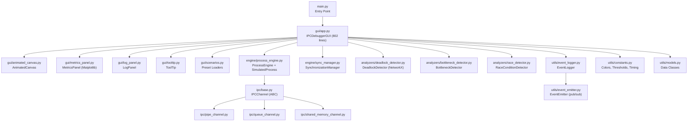

# IPC Debugger & Visualization Tool — Comprehensive Report

> **Project**: CSE316 Operating Systems — Project 2 (Version 2)  
> **Date**: April 9, 2026  
> **Scope**: Full interface walkthrough, implementation analysis, and improvement recommendations

---

## 1. Project Architecture Overview

### Module Inventory

| Module | File | Lines | Purpose |
|--------|------|------:|---------|
| **GUI — Main App** | `gui/app.py` | 802 | Tab-based dashboard, all callbacks |
| **GUI — Canvas** | `gui/animated_canvas.py` | 292 | 60fps animated topology visualization |
| **GUI — Metrics** | `gui/metrics_panel.py` | 97 | Matplotlib bar charts |
| **GUI — Log** | `gui/log_panel.py` | 66 | Color-coded scrolling event log |
| **GUI — Control Panel** | `gui/control_panel.py` | 298 | Legacy panel (unused in V2 UI) |
| **GUI — Tooltip** | `gui/tooltip.py` | 44 | Hover tooltips |
| **GUI — Scenarios** | `gui/scenarios.py` | 99 | 3 preset scenario loaders |
| **Engine — Process** | `engine/process_engine.py` | 182 | Thread-based process simulation |
| **Engine — Sync** | `engine/sync_manager.py` | 207 | TrackedLock, TrackedSemaphore |
| **Analyzer — Deadlock** | `analyzers/deadlock_detector.py` | 132 | Wait-For Graph + cycle detection |
| **Analyzer — Bottleneck** | `analyzers/bottleneck_detector.py` | 134 | Queue depth, latency, throughput |
| **Analyzer — Race** | `analyzers/race_detector.py` | 113 | Time-window concurrent access analysis |
| **IPC — Base** | `ipc/base.py` | 70 | Abstract channel class |
| **IPC — Pipe** | `ipc/pipe_channel.py` | 73 | Single-slot queue (pipe sim) |
| **IPC — Queue** | `ipc/queue_channel.py` | 98 | FIFO queue with depth tracking |
| **IPC — SharedMem** | `ipc/shared_memory_channel.py` | 81 | Condition-variable shared memory |
| **Utils — Logger** | `utils/event_logger.py` | 74 | Thread-safe centralized logger |
| **Utils — Emitter** | `utils/event_emitter.py` | 58 | Pub/sub event dispatching |
| **Utils — Constants** | `utils/constants.py` | 132 | All design tokens & config |
| **Utils — Models** | `utils/models.py` | 111 | `@dataclass` definitions |
| **Tests** | `tests/` (9 files) | ~300+ | Unit tests for all modules |
| **Integration** | `run_all_scenarios.py` | 506 | Headless end-to-end test suite |
| **Total** | **27 files** | **~3,800+** | |

---

## 2. Interface Walkthrough (Based on Live Screenshots)

### 2.1 Header Bar
- **Title**: "🔬 IPC Debugger & Visualization Tool" with accent divider beneath
- **Controls** (right-aligned): ▶ Start (green), ⏸ Pause (amber), ⏹ Stop (red), 🔄 Reset (grey)
- **Status indicator**: "○ Idle" displays current simulation state
- **Assessment**: ✅ Clean, well-organized. All primary actions accessible at a glance.

### 2.2 Tab Panel (Left Sidebar, 380px)

#### 📦 Processes Tab
- Card-based "Add New Process" form with fields: Process ID, Behavior (combo), Message, Delay, Priority
- Tooltips on key fields (Process ID, Behavior, Delay)
- "Active Processes" section below with scrollable card list
- Each process card shows: behavior icon, PID, state badge, message stats, remove button
- **Assessment**: ✅ Well-structured. Fields are logically ordered with sensible defaults.

#### 🔗 Connections Tab
- Source/Destination combos (auto-populated from process list)
- Channel Type selector: pipe, queue, shared_memory
- Tooltips explaining each channel type
- "Active Connections" list below showing `Source → Dest` with type color coding
- **Assessment**: ✅ Clean and functional. Proper validation against self-connections and duplicates.

#### 🔍 Analysis Tab
- Four analysis tool cards stacked vertically:
  1. **Deadlock Detection** — Red "Run Detection" button + auto-detect checkbox
  2. **Bottleneck Analysis** — Depth/Latency/Ratio threshold fields + amber "Analyze" button
  3. **Race Condition Detection** — Red "Detect Races" button
  4. **Performance Metrics** — Blue "Show Metrics" button
- **Assessment**: ✅ Good card layout with descriptions. Threshold fields are editable inline.

#### ⚡ Scenarios Tab
- Three preset scenarios as cards:
  1. Normal IPC (Producer → Consumer)
  2. Deadlock Scenario (3 Processes → Circular Locks)
  3. Bottleneck Scenario (Fast → Slow)
- Each with "Load & Run" button + 🔄 Reset Everything
- Export section: CSV Log, PNG Graph, Metrics
- **Assessment**: ✅ Excellent for quick demos. Export options are practical.

### 2.3 Visualization Canvas (Right, Expandable)
- NetworkX `spring_layout` for node positioning
- Smooth LERP interpolation (8% per frame at 60fps)
- Nodes: colored circles by state (running/paused/deadlocked/idle)
- Edges: styled arrows (solid=pipe, dashed=queue, dotted=shared_memory)
- Deadlock glow: 3-ring red pulsing overlay on deadlocked nodes
- Pulse animation on active message transfers
- Legend overlay (top-left)
- **Assessment**: ✅ Visually appealing with smooth animations. Placeholder text when empty.

### 2.4 Event Log (Bottom Panel, Fixed 180px)
- Scrollable, color-coded log with emoji icons per event type
- Timestamps formatted as `HH:MM:SS`
- Tag-based coloring: SEND (green), RECEIVE (blue), DEADLOCK (red), etc.
- Clear button (top-right)
- **Assessment**: ✅ Functional and readable.

### 2.5 Metrics Panel (Below Canvas, Hidden by Default)
- Three Matplotlib subplots: Avg Latency, Throughput (msg/s), Queue Depth (current vs. peak)
- Dark theme consistent with app palette
- **Assessment**: ✅ Good visualization, appears on demand.

---

## 3. Implementation Analysis

### 3.1 Concurrency Model

| Aspect | Implementation | Notes |
|--------|---------------|-------|
| Process simulation | `threading.Thread` (daemon) | ✅ Correct for Tkinter-compatible concurrency |
| Pause/Resume | `threading.Event` (clear/set) | ✅ Clean pattern |
| Lock tracking | `TrackedLock` wrapping `threading.Lock` | ✅ Metadata via `_meta_lock` |
| Channel thread safety | Per-channel `_stats_lock` | ✅ Proper isolation |
| GUI updates | `root.after(0, callback)` from threads | ✅ Correct Tkinter thread dispatch |
| Event log | `deque(maxlen=10000)` with lock | ✅ Bounded, thread-safe |

### 3.2 IPC Channels

| Channel | Backend | Behavior |
|---------|---------|----------|
| **Pipe** | `queue.Queue(maxsize=1)` | Single-slot, blocks on full → simulates pipe semantics |
| **Queue** | `queue.Queue(maxsize=N)` | FIFO with depth/peak tracking, full-warning logs |
| **SharedMemory** | `threading.Condition` + variable | Wait/notify pattern, no size limit, atomic read/clear |

> [!NOTE]
> All three channels use `queue.Queue` or `threading.Condition` internally — none use actual OS-level IPC (multiprocessing, pipes, mmap). This is appropriate for a **simulation** but important to state clearly in academic context.

### 3.3 Analysis Engines

#### Deadlock Detector
- Builds Wait-For Graph from `SynchronizationManager.get_wait_for_edges()`
- Uses `nx.simple_cycles()` to find ALL cycles (not just the first)
- Also includes an educational manual DFS implementation (`find_cycle_dfs_manual`)
- **Assessment**: ✅ Correct algorithm. Good to have both library + manual implementations.

#### Bottleneck Detector  
- **Queue depth**: Compares against configurable threshold, Critical if >2× threshold
- **Latency**: FIFO-based pairing (fixed from naive index matching — Issue #4)
- **Throughput ratio**: recv/send ratio below threshold flags slow consumer
- **Assessment**: ✅ FIFO latency fix is a solid improvement. Three-metric approach is comprehensive.

#### Race Condition Detector
- Sliding window algorithm: flags concurrent access within configurable time window (default 50ms)
- Conditions: different PIDs + at least one write + not both locked
- Deduplicates reports per resource/PID pair
- **Assessment**: ⚠️ Functional but only detects races on **explicitly recorded** accesses. IPC channel operations don't auto-record to the race detector (see Improvements).

### 3.4 Key Bug Fixes Already Applied

| Issue | Fix | File |
|-------|-----|------|
| #2 — Lock release by wrong process | `TrackedLock.release()` checks `holder == process_id` | [sync_manager.py](file:///c:/Users/MSI%20PC/Desktop/ACADEMICS/SEMISTERS/SEMISTER%20FOUR/CSE316%20OPERATING%20SYSTEMS/OS%20PROJECT%202%20VERSION%202/engine/sync_manager.py#L52-L66) |
| #3 — SharedMemory race condition | Replaced `multiprocessing.Array` with `threading.Condition` | [shared_memory_channel.py](file:///c:/Users/MSI%20PC/Desktop/ACADEMICS/SEMISTERS/SEMISTER%20FOUR/CSE316%20OPERATING%20SYSTEMS/OS%20PROJECT%202%20VERSION%202/ipc/shared_memory_channel.py) |
| #4 — Latency computation | FIFO deque pairing instead of naive index match | [bottleneck_detector.py](file:///c:/Users/MSI%20PC/Desktop/ACADEMICS/SEMISTERS/SEMISTER%20FOUR/CSE316%20OPERATING%20SYSTEMS/OS%20PROJECT%202%20VERSION%202/analyzers/bottleneck_detector.py#L77-L93) |
| #5 — producer_consumer behavior | Now properly interleaves `_do_send` AND `_do_receive` | [process_engine.py](file:///c:/Users/MSI%20PC/Desktop/ACADEMICS/SEMISTERS/SEMISTER%20FOUR/CSE316%20OPERATING%20SYSTEMS/OS%20PROJECT%202%20VERSION%202/engine/process_engine.py#L99-L102) |

---

## 4. Things That Could Be Improved

### 🔴 Priority 1 — Functional Issues

| # | Issue | Details | Files |
|---|-------|---------|-------|
| 1 | **Dead code: `control_panel.py`** | The 298-line `ControlPanel` class is never imported or used by `app.py`. The V2 UI builds everything inline. This is dead weight that could confuse maintainers. | [control_panel.py](file:///c:/Users/MSI%20PC/Desktop/ACADEMICS/SEMISTERS/SEMISTER%20FOUR/CSE316%20OPERATING%20SYSTEMS/OS%20PROJECT%202%20VERSION%202/gui/control_panel.py) |
| 2 | **Race detector is disconnected** | `RaceConditionDetector.record_access()` is never called by any IPC channel. The detector only works if accesses are manually recorded (e.g., in scenarios). In the GUI, "Detect Races" will always say "No races detected." | [race_detector.py](file:///c:/Users/MSI%20PC/Desktop/ACADEMICS/SEMISTERS/SEMISTER%20FOUR/CSE316%20OPERATING%20SYSTEMS/OS%20PROJECT%202%20VERSION%202/analyzers/race_detector.py), [shared_memory_channel.py](file:///c:/Users/MSI%20PC/Desktop/ACADEMICS/SEMISTERS/SEMISTER%20FOUR/CSE316%20OPERATING%20SYSTEMS/OS%20PROJECT%202%20VERSION%202/ipc/shared_memory_channel.py) |
| 3 | **PNG export saves PostScript** | `_save_graph_png` actually saves `.ps` (PostScript), not PNG. The button label says "PNG Graph" but `filetypes` and `postscript()` both use PS format. | [app.py L746-754](file:///c:/Users/MSI%20PC/Desktop/ACADEMICS/SEMISTERS/SEMISTER%20FOUR/CSE316%20OPERATING%20SYSTEMS/OS%20PROJECT%202%20VERSION%202/gui/app.py#L746-L754) |
| 4 | **Pause doesn't toggle to Resume** | Clicking Pause changes status but the button still says "Pause". There's no Resume action — the user must Stop and Start again to continue. `ProcessEngine.resume_all()` exists but is never called from the GUI. | [app.py L586-592](file:///c:/Users/MSI%20PC/Desktop/ACADEMICS/SEMISTERS/SEMISTER%20FOUR/CSE316%20OPERATING%20SYSTEMS/OS%20PROJECT%202%20VERSION%202/gui/app.py#L586-L592) |
| 5 | **`send_times`/`receive_times` lists grow unbounded** | These lists in `IPCChannel` are never trimmed. Over a long simulation, they accumulate indefinitely, consuming memory. | [base.py L26-27](file:///c:/Users/MSI%20PC/Desktop/ACADEMICS/SEMISTERS/SEMISTER%20FOUR/CSE316%20OPERATING%20SYSTEMS/OS%20PROJECT%202%20VERSION%202/ipc/base.py#L26-L27) |

### 🟡 Priority 2 — UI/UX Improvements

| # | Issue | Recommendation |
|---|-------|----------------|
| 6 | **Tab labels are truncated** | Tab titles show as "Proc…", "Conne…", "Anal…", "Scen…" (visible in screenshot). Shorten labels or widen the tab strip. Consider using icons only with tooltips. |
| 7 | **No connection removal** | Users can remove processes but not individual connections. Need a delete button on each connection card. |
| 8 | **Process card scroll has no scrollbar** | The active process list uses a `Canvas` for scrolling but doesn't attach a visible scrollbar. Mouse wheel scrolling may also not work. |
| 9 | **No keyboard shortcuts** | No Ctrl+S to start, Ctrl+P to pause, etc. Adding accelerators would improve power-user experience. |
| 10 | **Combobox styling inconsistency** | ttk Comboboxes don't fully adopt the dark theme — dropdown lists appear with system-default white background on Windows. |
| 11 | **Log panel fixed height** | The 180px log panel can't be resized. A draggable splitter between canvas and log would improve usability. |
| 12 | **No confirmation on Reset** | "Reset Everything" immediately destroys all state without asking. Should show a confirmation dialog. |

### 🟢 Priority 3 — Engine & Analysis Enhancements

| # | Issue | Recommendation |
|---|-------|----------------|
| 13 | **No Semaphore UI** | `TrackedSemaphore` is fully implemented but has no GUI controls to create or assign semaphores to processes. |
| 14 | **Auto-deadlock uses main thread timer** | The 2-second auto-detect runs `detect_deadlock()` inside `root.after()`. For large graphs, this could freeze the UI. Should run in a background thread and post results via `root.after()`. |
| 15 | **`spring_layout` recomputed every refresh** | `update_topology()` runs `nx.spring_layout()` on every 2-second tick, even when topology hasn't changed. Cache the layout and only recompute on add/remove. |
| 16 | **No starvation detection** | The system detects deadlocks and bottlenecks but doesn't detect process starvation (a process that never gets CPU time due to priority). |
| 17 | **Throughput calculation edge case** | `throughput = len(send_times) / duration` — if only 1 message is sent, `duration = 0`, and throughput defaults to 0. Should handle the single-message case. |
| 18 | **Priority scheduling is simplistic** | `effective_delay = delay × (11 - priority) / 10` only affects sleep time. A real priority queue or preemptive scheduler would be more educationally valuable. |

### 🔵 Priority 4 — Code Quality & Architecture

| # | Issue | Recommendation |
|---|-------|----------------|
| 19 | **`app.py` is 802 lines** | A "God class" — handles UI construction, all callbacks, scenario loading, export logic, and refresh timers. Extract callback logic into a `SimulationController` class. |
| 20 | **Bare `except` clauses** | Lines 633, 635, 637 use bare `except: pass` for threshold parsing. Should use `except ValueError`. |
| 21 | **`depth_history` grows unbounded** | `QueueChannel.depth_history` is never used by any analysis or visualization. Either use it for a time-series chart or remove it. |
| 22 | **No type hints on GUI methods** | Most methods in `app.py` lack return type annotations and parameter types. |
| 23 | **`gui/__init__.py` imports `scenarios`** | The init file imports `from gui.scenarios import *` which could cause circular import issues if scenarios ever imports from gui. |
| 24 | **Test coverage gaps** | No tests for `animated_canvas.py`, `log_panel.py`, `metrics_panel.py`, or any GUI integration tests. |
| 25 | **No logging framework** | Uses `print()` in `run_all_scenarios.py` and Python's `logging` module only in `event_emitter.py`. Should standardize on `logging` throughout. |

### 💡 Priority 5 — Feature Additions

| # | Feature | Description |
|---|---------|-------------|
| 26 | **Timeline view** | Add a horizontal timeline visualization showing message sends/receives over time, similar to a Gantt chart. |
| 27 | **Step-by-step mode** | Allow single-stepping through simulation ticks for educational debugging. |
| 28 | **Resource Allocation Graph** | Complement the Wait-For Graph with a full RAG showing processes, resources, and assignment/request edges. |
| 29 | **Save/Load topology** | Serialize the current process + connection configuration to JSON for reloading later. |
| 30 | **Dark/Light theme toggle** | All colors are hardcoded to dark theme. Add a toggle with a light palette variant. |
| 31 | **Process grouping/clustering** | Allow grouping related processes visually (e.g., producer pool, consumer pool). |

---

## 5. Summary Assessment

### Strengths ✅
- **Well-modularized architecture** — clean separation between GUI, engine, analyzers, IPC, and utils
- **Modern dark-themed UI** — visually polished with emoji icons, card layouts, and smooth 60fps canvas animations
- **Comprehensive analysis suite** — deadlock (WFG + cycle detection), bottleneck (3 metrics), race condition (sliding window)
- **Strong test coverage** — 9 unit test files + a 506-line integration test suite
- **Thread-safe design** — proper use of locks, events, and conditions throughout
- **Good data modeling** — centralized `@dataclass` definitions with clear semantics
- **Bug fixes documented** — Issues #2–#5 are explicitly documented in code comments

### Weaknesses ⚠️
- **Race detector is disconnected** — the most significant functional gap; it can't detect anything in normal operation
- **God class (`app.py`)** — 802 lines mixing concerns; would benefit from MVC refactoring
- **Dead code** — `control_panel.py` is entirely unused
- **Missing resume flow** — Pause is a one-way action
- **Memory leaks in long runs** — unbounded lists for timing data

### Overall Grade: **B+**
A solid academic project with strong fundamentals and a polished interface. The architecture is clean and extensible. Addressing the top 5 functional issues would elevate it to A-level work.
