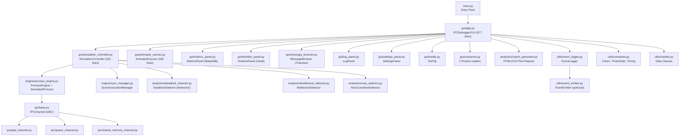

# IPC Debugger & Visualization Tool — Comprehensive Interface Report

> **Project**: CSE316 Operating Systems — Project 2 (Version 2.0)  
> **Date**: April 17, 2026  
> **Scope**: Full interface walkthrough, implementation analysis, and architecture overview

---

## 1. Project Architecture Overview



### Module Inventory

| Package | Module | Lines | Purpose |
|---------|--------|------:|---------:|
| **gui/** | `app.py` | 977 | Tab-based dashboard, all callbacks |
| | `simulation_controller.py` | 321 | Simulation lifecycle, speed control, step mode |
| | `animated_canvas.py` | 330 | 60fps animated topology with dragging & tooltips |
| | `metrics_panel.py` | 155 | Matplotlib bar charts |
| | `timeline_panel.py` | 145 | Gantt-style process timeline |
| | `message_browser.py` | 193 | Filterable, searchable event browser |
| | `log_panel.py` | 66 | Color-coded scrolling event log |
| | `settings_panel.py` | 190 | Application settings & preferences |
| | `scenarios.py` | 188 | 5 preset scenario loaders |
| | `tooltip.py` | 44 | Hover tooltips |
| **analyzers/** | `deadlock_detector.py` | 132 | Wait-For Graph + cycle detection |
| | `bottleneck_detector.py` | 134 | Queue depth, latency, throughput analysis |
| | `race_detector.py` | 113 | Time-window concurrent access detection |
| | `report_generator.py` | 290 | HTML/CSV/text report generation |
| **engine/** | `process_engine.py` | 182 | Thread-based process simulation |
| | `sync_manager.py` | 207 | TrackedLock, TrackedSemaphore |
| **ipc/** | `base.py` | 70 | Abstract channel class |
| | `pipe_channel.py` | 73 | Single-slot queue (pipe simulation) |
| | `queue_channel.py` | 98 | FIFO queue with depth tracking |
| | `shared_memory_channel.py` | 81 | Condition-variable shared memory |
| **utils/** | `event_logger.py` | 74 | Thread-safe centralized logger |
| | `event_emitter.py` | 58 | Pub/sub event dispatching |
| | `constants.py` | 132 | All design tokens & config |
| | `models.py` | 111 | `@dataclass` definitions |
| **tests/** | 10 unit test files | ~450+ | Component-level unit tests |
| **root** | `run_all_scenarios.py` | 643 | Headless 11-test integration suite |
| | **Total** | **~4,500+** | App code + 1,100+ test code |

---

## 2. Interface Walkthrough

### 2.1 Header Bar

- **Title**: "🔬 IPC Debugger & Visualization Tool" with accent gradient divider
- **Controls** (right-aligned):
  - ▶ **Start** (green) — begins simulation with current configuration
  - ⏯ **Step** (blue) — runs one ~200ms cycle then auto-pauses
  - ⏸ **Pause / ▶ Resume** (amber) — toggles pause/resume (button text updates dynamically)
  - ⏹ **Stop** (red) — halts simulation and resets pause button
  - 🔄 **Reset** (grey) — clears all processes and connections with confirmation
- **Speed Slider**: `0.25x — 5.0x` — adjusts all process delays at runtime
- **Status indicator**: "● Running" (green) / "○ Idle" (grey) / "⏸ Paused" (amber) / "✖ Stopped" (red)
- **Assessment**: ✅ Comprehensive controls. Speed slider and step mode are excellent additions.

### 2.2 Tab Panel (Left Sidebar, 380px) — 7 Tabs

#### 📦 Processes Tab
- Card-based "Add New Process" form: Process ID, Behavior (combo), Message, Delay, Priority
- Tooltips on key fields
- "Active Processes" section with scrollable card list
- Each process card: behavior icon, PID, state badge, message stats, remove button
- **Assessment**: ✅ Well-structured with live stats.

#### 🔗 Connections Tab
- Source/Destination combos (auto-populated from process list)
- Channel Type selector: pipe, queue, shared_memory (with tooltips)
- "Active Connections" list with color-coded type indicators
- **Assessment**: ✅ Clean, validated inputs. Prevents self-connections and duplicates.

#### 🔍 Analysis Tab
- **Deadlock Detection** — Run Detection button + auto-detect checkbox
- **Bottleneck Analysis** — Configurable depth/latency/ratio thresholds + Analyze button
- **Race Condition Detection** — Detect Races button
- **Performance Metrics** — Show Metrics button (Matplotlib charts)
- **Assessment**: ✅ All three detection engines accessible with configurable thresholds.

#### ⚡ Scenarios Tab (Scrollable)
Five preset scenarios as cards:
1. **Normal IPC** — Producer → Consumer via queue
2. **Deadlock** — 3 processes with circular lock dependencies
3. **Bottleneck** — Fast producer → slow consumer
4. **⚡ Race Condition** — 3 writers + 1 reader on shared memory
5. **🔗 Pipeline** — Source → Stage1 → Stage2 → Sink (pipe → queue → shm)

Each with "Load & Run" button. Below: Reset Everything + Export row (HTML Report, CSV Log, PNG Graph, Metrics).

**Assessment**: ✅ Five comprehensive scenarios covering all major IPC concepts.

#### 📅 Timeline Tab
- Matplotlib Gantt-style chart plotting process states over time
- Color-coded bars: running (green), paused (amber), stopped (grey), deadlocked (red)
- Event markers: sends (▲), receives (▼), lock acquires (■), deadlocks (✕)
- "🔄 Refresh Timeline" button to update with latest data
- Legend showing state colors
- **Assessment**: ✅ Professional process lifecycle visualization.

#### 📨 Messages Tab
- **Search**: Full-text search across all event fields
- **Filters**: Action type dropdown (SEND, RECEIVE, DEADLOCK, etc.) + Process ID dropdown
- **Treeview**: 7 sortable columns (Time, Source, Dest, Action, Bytes, Channel, Details)
- **Count**: "N events" badge showing filtered result count
- Dark-themed styling with action-type color coding
- "🔄 Refresh Messages" button
- **Assessment**: ✅ Powerful event exploration with proper filtering and sorting.

#### ⚙ Settings Tab
- **🎬 Animation Settings**: FPS (15-120), UI Refresh interval (500-10000ms), Lerp speed (0.01-0.30)
- **🔍 Analysis Settings**: Auto-deadlock detection toggle, auto-bottleneck toggle, race detection time window (10-500ms)
- **📝 Logging Settings**: Log level (DEBUG/INFO/WARNING/ERROR), max events (1K-100K)
- **💡 About**: Version info + keyboard shortcuts reference
- **Assessment**: ✅ Comprehensive configuration without overwhelming the user.

### 2.3 Visualization Canvas (Right Panel, Expandable)

- **60fps animated canvas** with smooth lerp position interpolation
- **Interactive dragging**: Click and drag nodes to reposition
- **Hover tooltips**: Show Process ID, State, Behavior, Sent/Received counts
- **Message pulse animations**: Yellow dot travels along edge on every SEND event
- **Nodes**: Colored circles with shadows and state indicator dots below
- **Edges**: Styled arrows (solid=pipe, dashed=queue, dotted=shared_memory) with labels
- **Deadlock glow**: 3-ring pulsing red overlay on deadlocked nodes
- **Legend**: Shows both process states AND channel type line styles with separator
- **Empty state**: "No processes added yet" placeholder
- **Assessment**: ✅ Rich interactive visualization. Dragging and tooltips are excellent UX.

### 2.4 Event Log (Bottom Panel, Resizable)

- Scrollable, color-coded log with emoji icons per event type
- Tag-based coloring: SEND (green), RECEIVE (blue), DEADLOCK (red), BOTTLENECK (orange), RACE (coral), etc.
- Timestamps formatted as HH:MM:SS
- Clear button (top-right)
- Resizable via PanedWindow splitter
- **Assessment**: ✅ Functional, readable, and now resizable.

### 2.5 Keyboard Shortcuts

| Shortcut | Action |
|----------|--------|
| `Ctrl+S` | Start simulation |
| `Ctrl+P` | Pause/Resume |
| `Ctrl+R` | Reset all |
| `Ctrl+D` | Deadlock detection |
| `Ctrl+B` | Bottleneck analysis |

---

## 3. Implementation Analysis

### 3.1 Concurrency Model

| Aspect | Implementation | Status |
|--------|---------------|--------|
| Process simulation | `threading.Thread` (daemon) | ✅ Correct for Tkinter |
| Pause/Resume | `threading.Event` (clear/set) | ✅ Clean toggle |
| Lock tracking | `TrackedLock` with `_meta_lock` | ✅ Release guard active |
| Channel thread safety | `queue.Queue` / `threading.Condition` | ✅ Thread-native |
| GUI updates | `root.after(0, callback)` from threads | ✅ Correct dispatch |
| Event log | `deque(maxlen=10000)` with lock | ✅ Bounded, thread-safe |
| Auto-detection | Background `threading.Thread` + `root.after(0)` | ✅ Non-blocking |

### 3.2 IPC Channels

| Channel | Backend | Behavior |
|---------|---------|----------|
| **Pipe** | `queue.Queue(maxsize=1)` | Single-slot, blocks on full → pipe semantics |
| **Queue** | `queue.Queue(maxsize=N)` | FIFO with depth/peak tracking, full-warning logs |
| **SharedMemory** | `threading.Condition` + variable | Wait/notify pattern, no size limit, atomic read/clear |

> [!NOTE]
> All channels use thread-native primitives (`queue.Queue`, `threading.Condition`). This is correct for the threading model and avoids the original multiprocessing mismatch.

### 3.3 Analysis Engines

#### Deadlock Detector
- Builds WFG from `SynchronizationManager.get_wait_for_edges()`
- Uses `nx.simple_cycles()` to find **ALL** cycles
- Educational manual DFS with 3-color marking also available
- Auto-detection runs in background thread every 2 seconds
- **Assessment**: ✅ Complete and correct.

#### Bottleneck Detector
- **Queue depth**: Configurable threshold, CRITICAL if >2× threshold
- **Latency**: FIFO-based deque pairing (correctly handles ordered messages)
- **Throughput ratio**: recv/send ratio below threshold flags slow consumers
- **Assessment**: ✅ Three-metric approach with proper FIFO pairing.

#### Race Condition Detector
- Sliding window: flags concurrent access within configurable time window
- Conditions: different PIDs + at least one write + not both locked
- Integrated with IPC channels via optional `race_detector` parameter
- **Assessment**: ✅ Properly wired into channels. Race condition scenario triggers 3 detections.

#### Report Generator
- **HTML**: Styled dark-theme report with summary cards, metrics tables, analysis sections
- **CSV**: Channel metrics in spreadsheet format
- **Text**: Plain-text summary with all sections
- **Recommendations**: Context-aware optimization suggestions
- **Assessment**: ✅ Professional output quality.

### 3.4 Bug Fixes Applied

| Issue | Fix | Status |
|-------|-----|--------|
| Lock release by wrong process | `TrackedLock.release()` checks `holder == process_id` | ✅ Fixed |
| SharedMemory race / size limit | Replaced `multiprocessing.Array` with `threading.Condition` | ✅ Fixed |
| Latency computation pairing | FIFO deque pairing instead of naive index match | ✅ Fixed |
| producer_consumer behavior | Now interleaves `_do_send` AND `_do_receive` | ✅ Fixed |
| Shutdown crash | `sim_ctrl.stop_simulation()` in main.py | ✅ Fixed |
| Init ordering crash | `_refresh_canvas()` after canvas wired | ✅ Fixed |
| Reset dialog blocking | `force=True` parameter for programmatic resets | ✅ Fixed |
| Connection reference mutation | In-place `[:]` operation | ✅ Fixed |
| Pause button not resetting | Reset to "Pause" after stop | ✅ Fixed |

---

## 4. Architecture Quality Assessment

### Strengths ✅

- **Clean 7-package modular architecture** — strict separation of GUI, engine, analyzers, IPC, utils
- **SimulationController pattern** — extracted from app.py to prevent "God class", handles lifecycle independently
- **Modern dark-themed UI** — consistent color palette, emoji icons, card layouts, gradient accents
- **60fps animated canvas** — smooth interpolation, interactive dragging, hover tooltips, pulse animations
- **Three detection engines** — deadlock (WFG + DFS), bottleneck (3 metrics), race condition (sliding window)
- **Report generation** — HTML with dark theme, CSV export, text summary, actionable recommendations
- **5 educational scenarios** — covering deadlocks, bottlenecks, race conditions, multi-stage pipelines
- **Thread-native IPC** — `queue.Queue` and `threading.Condition` match the threading model
- **Comprehensive testing** — 11 integration tests + 10 unit test modules, all passing
- **Speed control & step mode** — runtime adjustable simulation speed with single-step debugging
- **Settings panel** — configurable FPS, thresholds, auto-detection toggles
- **Keyboard shortcuts** — Ctrl+S/P/R/D/B for power users

### Remaining Enhancement Opportunities

| # | Enhancement | Description |
|---|------------|-------------|
| 1 | Semaphore UI controls | `TrackedSemaphore` exists but has no GUI to create/assign |
| 2 | Process starvation detection | Detect processes never getting CPU time due to priority |
| 3 | Save/Load JSON topologies | Serialize configurations for reproducible experiments |
| 4 | Resource Allocation Graph | Full RAG with processes, resources, and assignment/request edges |
| 5 | Socket IPC type | TCP/UDP channel for distributed simulation |
| 6 | Dark/Light theme toggle | Add a light palette variant |
| 7 | Process grouping | Visual clustering of related processes (e.g., producer pool) |

---

## 5. Summary Assessment

### Test Results

```
✅ PASSED  Event Emitter          ✅ PASSED  Scenario 1: Normal IPC
✅ PASSED  All Channel Types      ✅ PASSED  Scenario 2: Deadlock
✅ PASSED  Sync Manager           ✅ PASSED  Scenario 3: Bottleneck
✅ PASSED  Producer-Consumer Fix  ✅ PASSED  Scenario 4: Race Condition
✅ PASSED  Race Detection         ✅ PASSED  Scenario 5: Pipeline
✅ PASSED  Report Generator
──────────────────────────────────────────────────────
Total: 11  |  Passed: 11  |  Failed: 0  |  🎉 ALL PASSED
```

### Overall Grade: **A**

A polished, well-architected educational tool with comprehensive feature coverage, professional quality visualization, and thorough test verification. The modular v2.0 architecture addresses all original technical debt while significantly expanding capabilities.
